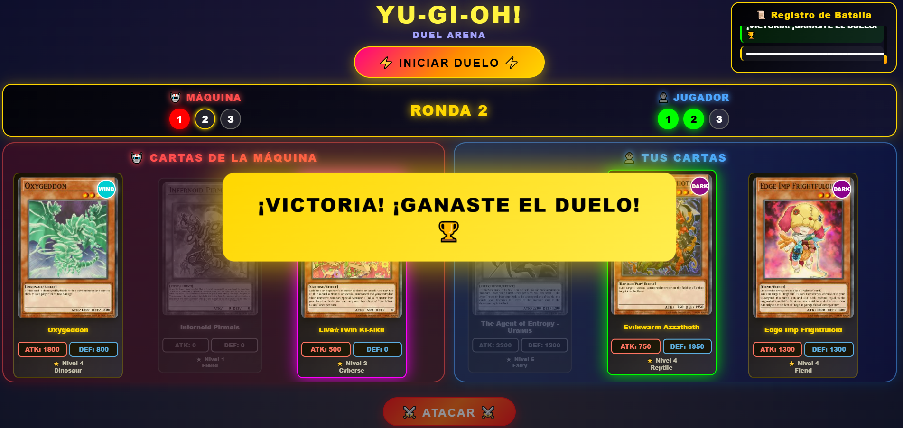

# Yu-Gi-Oh! Duel Game
### INTEGRANTES
- Yessica Fernanda Villa Nuñez - 2266301
- Luis Manuel Cardona Trochez - 2059942

## 📋 Descripción del Proyecto

Aplicación web interactiva de duelos de Yu-Gi-Oh! desarrollada con CodeIgniter 4. El juego permite a los usuarios enfrentarse contra la máquina en un sistema de mejor de 3 rondas, donde cada jugador selecciona cartas aleatorias obtenidas de la API oficial de Yu-Gi-Oh!

### Características Principales

- Sistema de duelo al mejor de 3 rondas
- Cartas aleatorias obtenidas de la API de YGOProDeck
- Combate basado en estadísticas ATK/DEF
- Marcador visual en tiempo real
- Registro detallado de batallas
- Interfaz moderna con efectos visuales

## 📁 Estructura del Proyecto

```
└── 📁YuGiOh
    └── 📁app
        └── 📁Controllers
            ├── BaseController.php
            └── YugiohDuelController.php
        └── 📁Libraries
            └── YugiohApiClient.php
        └── 📁Models
            └── Card.php
        └── 📁Views
            └── 📁yugioh
                └── index.php
    ├── .env
    ├── .htaccess
    └── README.md
```

## 🛠️ Requisitos del Sistema

- PHP >= 7.4
- CodeIgniter 4.x
- Servidor web (Apache/Nginx)
- Conexión a internet (para consumir la API)
- Composer

## 🚀 Instalación

### 1. Clonar o descargar el proyecto

```bash
git clone <url-del-repositorio>
cd YuGiOh
```

### 2. Configurar el archivo `.env`

Copia el archivo `.env` de ejemplo y configura las siguientes variables:

```env
#--------------------------------------------------------------------
# ENVIRONMENT
#--------------------------------------------------------------------
CI_ENVIRONMENT = development

#--------------------------------------------------------------------
# APP
#--------------------------------------------------------------------
public $baseURL = 'http://localhost/YuGiOh/'

#--------------------------------------------------------------------
# API CONFIGURATION
#--------------------------------------------------------------------
API_BASE_URL = 'https://db.ygoprodeck.com/api/v7/cardinfo.php'
```

### 3. Instalar dependencias de Composer

```bash
composer install
```

### 4. Configurar permisos

Asegúrate de que las carpetas `writable` tengan permisos de escritura:

```bash
chmod -R 777 writable/
```

## ▶️ Ejecución

###  Servidor Apache/Nginx

1. Configura tu servidor web para apuntar al directorio `public/`
2. Asegúrate de que el mod_rewrite esté habilitado (Apache)
3. Accede a: `http://localhost/YuGiOh/yugioh`

## Uso de la Aplicación

1. **Iniciar Duelo**: Haz clic en el botón "INICIAR DUELO"
2. **Seleccionar Carta**: Elige una de tus 3 cartas disponibles
3. **Atacar**: Presiona el botón "BATALLA" para ejecutar la ronda
4. **Victoria**: El primero en ganar 2 rondas gana el duelo

### Reglas del Combate

- Se compara el ATK de ambas cartas
- La carta con mayor ATK gana la ronda
- En caso de empate en ATK, se compara DEF
- Si hay empate total, se decide aleatoriamente
- Cada carta solo puede usarse una vez por duelo


## Rutas Disponibles

| Método | Ruta | Descripción |
|--------|------|-------------|
| GET | `/yugioh` | Vista principal del juego |
| POST | `/yugioh/iniciar` | Inicia un nuevo duelo (AJAX) |

## 🌐 API Externa

El proyecto consume la API pública de YGOProDeck:

**Endpoint**: `https://db.ygoprodeck.com/api/v7/cardinfo.php`

### Respuesta de ejemplo:
```json
{
  "data": [
    {
      "id": 12345,
      "name": "Dark Magician",
      "type": "Normal Monster",
      "desc": "The ultimate wizard...",
      "atk": 2500,
      "def": 2100,
      "level": 7,
      "race": "Spellcaster",
      "attribute": "DARK",
      "card_images": [
        {
          "image_url": "https://...",
          "image_url_small": "https://..."
        }
      ]
    }
  ]
}
```

## 💻 Tecnologías Utilizadas

- **Backend**: CodeIgniter 4, PHP
- **Frontend**: HTML5, CSS, JavaScript 
- **Estilos**: Bootstrap 5
- **API**: YGOProDeck API
- **Arquitectura**: MVC (Model-View-Controller)


## Explicacion de diseño
Para el desarrollo del backend del proyecto, hemos utilizado PHP y el framework CodeIgniter, que sigue el patrón MVC (Modelo-Vista-Controlador).  Esta estructura organiza la lógica del juego y el flujo de datos de manera eficaz y clara.  Los controladores, por ejemplo YugiohDuelController.php, se encargan de las solicitudes del usuario, se comunican con los modelos como Card.php para adquirir la información sobre las cartas y retornan respuestas en formato JSON al frontend.  CodeIgniter provee instrumentos para gestionar rutas, validar, asegurar y comunicarse entre capas, lo que posibilita una arquitectura del sistema de duelos que es escalable, eficiente y ordenada.
El frontend, que se compone de HTML, CSS y JavaScript, brinda una experiencia visual dinámica e inmersiva.  Los estilos que se encuentran en style.css desarrollan un entorno con influencias de Yu-Gi-Oh!, utilizando partículas, animaciones y gradientes que comunican emoción y energía.  El archivo script.js se encarga de la interactividad del jugador, mostrando las cartas, actualizando los resultados de cada ronda y controlando los efectos visuales en función de las acciones.  En su conjunto, la interfaz une una estética atractiva con una respuesta fluida, lo que permite que cada combate sea fácil de jugar, visualmente impresionante e inmersivo.

## Capturas de pantalla
1. Inicio

2. Carga de cartas

3. Vista

4. Carta seleccionada - Boton habilitado

5. Cartas jugadas - Usuario ganador - Log de batalla

6. Aviso de victoria/derrota



Para preguntas o sugerencias, puedes contactar a través de [tu-email@ejemplo.com]
